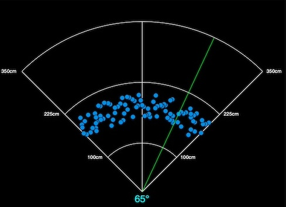

# IoT Radar: Python - MicroPython - Mosquito MQTT

This repository contains a basic IoT MQTT solution to create a radar animation (_incl. distance and angle_). The publisher script is written in MicroPython and subscriber script is written in Python.

I tested the Mosquito MQTT broker on Raspberry Pi 4 - Bookworm, the MQTT publisher Radar UI on macOS 14.3 and the subscriber on ESP32 - MicroPython 1.20.0.

## Install Mosquito MQTT broker

```shell
# update packages (optional)
$ apt update && apt upgrade -y

# install mosquitto broker and clients
$ apt install -y mosquitto mosquitto-clients

# stop mosquitto service (optional)
$ systemctl stop mosquitto.service

# add configuration
$ vim /etc/mosquitto/conf.d/mosquitto_add.conf

# start mosquitto service
$ systemctl start mosquitto.service

# verify mosquitto service status (optional)
$ systemctl status mosquitto.service

# enable mosquitto service
$ systemctl enable mosquitto.service
```

### mosquitto_add.conf

This is the content for `/etc/mosquitto/conf.d/mosquitto_add.conf`. It will create a listener for anonymous remote connections. Don't use in production!

```
listener 1883
allow_anonymous true
```

## Test Mosquitto

You can use this manual test for the `mosquitto.service` and also to test publisher: `main.py` and/or subscriber: `example.py`.

### ttys001

```shell
# client for subscribing to topics
$ mosquitto_sub -d -t python/mqtt
```

### ttys002

```shell
# client for publishing simple messages
$ mosquitto_pub -d -t python/mqtt -m "90;225"
```

> **Important for `example.py`:** 
> - The first value `90` means degrees in ° and second value `225` means distance in cm.
> - Values must be separated by `;`
> - Degrees min value is `45` and max value is `135` for `radar.py`
> - Distance min value is `0` and max value is `350` for `radar.py`

## Local Development Environment

> Adapt the values inside `configuration.py` for your needs!
> - WLAN_SSID
> - WLAN_PASSWORD
> - MQTT_BROKER (_IP address is also possible_)

### Prepare local development environment

```shell
# create virtualenv
$ python3 -m venv .venv

# activate virtualenv
$ source .venv/bin/activate

# install requirements
$ pip3 install -r requirements.txt
```

### Upload publisher scripts to ESP32

> The device name `cu.usbserial-0001` can be different for you!

```shell
# verifiy serial connection (optional)
(.venv) $ ls -la /dev/cu.*
crw-rw-rw-  1 root  wheel  0x9000007 Feb  1 16:43 /dev/cu.usbserial-0001

# upload main.py to ESP32
(.venv) $ rshell -p /dev/cu.usbserial-0001 cp main.py /pyboard/

# upload configuration.py to ESP32
(.venv) $ rshell -p /dev/cu.usbserial-0001 cp -r config /pyboard/

# start MicroPython repl (optional)
(.venv) $ rshell -p /dev/cu.usbserial-0001 repl
```

## Run everything

> The broker should run already and must be reachable! It doesn't matter in which order you start the publisher: `main.py` and subscriber: `example.py`.

### Start subscriber script on local environment

**Start: `example.py`**

```shell
# start subscriber
(.venv) $ python3 -B example.py 
```

**Stop: `radar.py`**

Press `ctrl` + `c` to stop `example.py` execution.

### Start publisher script to ESP32

**Start: `main.py`**

Press `ctrl` + `d` (_if you use REPL_) or reset button on device to start the `main.py` on ESP32 device.

**Stop: `main.py`**

If you're inside the REPL, you can press `ctrl` + `c` to stop execution and `ctrl` + `x` to close REPL and connection.

### Example result



## Additional information

**Stop: virtualenv**

```shell
# stop virtualenv
(.venv) $ deactivate
```
